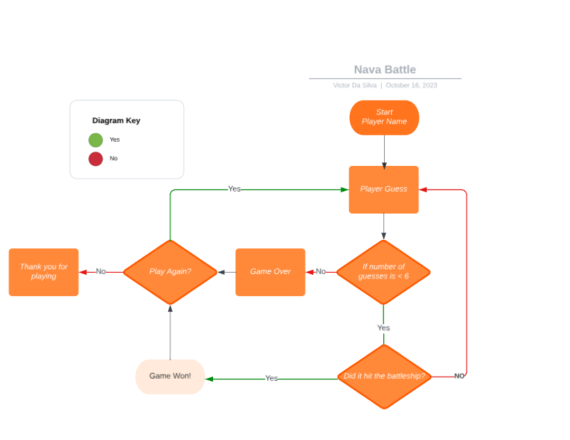
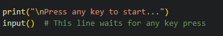

# Naval Battle

Welcome to Naval Battle, an engaging card matching game with a naval warfare theme. Test your  strategy skills as you aim to sink all the battleships!

## Table of Contents
- [Naval Battle](#naval-battle)
  - [Table of Contents](#table-of-contents)
  - [Introduction](#introduction)
  - [Game Features](#game-features)
    - [Player Name](#player-name)
    - [Guesses on the grid](#attempts-marked-on-the-grid)
    - [Play Again](#play-again)
  - [How to Play](#how-to-play)
  - [Deployment](#deployment)
  - [Logic Flow Chart](#logic-flow-chart)
  - [Bugs](#bugs)
    - [Bug 1: Columns Number Without Spacing](#columns-number-without-spacing)
    - [Bug 2: Press Any Key](#press-any-key)
    - [Bug 3: Player Name not found](player-name-not-found)
  - [Testing](#testing) 
  - [Goals](#goals)
  - [Credits](#credits)
  - [License](#license)

  

## Introduction

Welcome to the Naval Battle game! This is a simple Python-based game where you try to sink the computer's battleship by guessing its location on a 5x5 grid. This readme provides an overview of the game, its rules, and how to play.

## Game Features

**Naval Battle** offer's a couple of simple features that enhance and simplify your gaming experience:

### Player Name

- Allow players to input their names at the start of the game. The game recalls the name, creating a more engaging and personalized experience, with this feature we can enhanced player engagement and a personal touch to the gaming experience.

    

### Guesses on the grid

- The game utilizes a grid to mark player guesses. Correct guesses result in a "hit," while incorrect guesses are marked with an "X" on the grid. Duplicate guesses are also tracked. It provides a visual feedback to the player about their guesses, enhancing the gameplay experience and preventing redundant guesses.

    

### Play Again

- After a game ends, players are given the option to play again. If they choose to do so, the game can be replayed with the same name and without showing the rules again. Allows for quick and convenient game replay without the need to re-enter the player's name or view the rules repeatedly. Enhances the overall user experience.

    

## How to Play

1. Objective: The objective of the game is to sink the computer's battleship by correctly guessing its location on a 5x5 grid.

2. Attempts: You have a total of 6 attempts to guess the battleship's location.

3. Grid: The game is played on a 5x5 grid, and you will guess both the row and column where you think the battleship is located. The rows and columns are numbered from 1 to 5.

4. Winning Condition: If you guess the correct row and column where the battleship is positioned, you win the game.

5. Missed Guesses: If your guess is incorrect, the grid will mark the location with an 'X' to indicate a missed guess.

6. Repeated Guesses: If you guess a location that you've already guessed in a previous turn, it won't count as a valid guess, and you won't be penalized for repeating the same guess.

7. Losing Condition: If you use up all 6 attempts and don't successfully guess the battleship's location, you lose the game. The game will reveal the battleship's location at this point.

## Deployment

The project was deployed using the Heroku Cloud applictaion platform.

It is assumed here that GitHub and GitPod accounts are already set up.

Preliminary steps...

a.	from the console window in GitPod enter the following command..

		pip freeze > requirements.txt
	
	This will push the requirements of the project into the requirements.txt file,
	and allow Heroku the configuration information that it needs to build the project.
	
b.	Make sure changes are committed and pushed to GitHub before continuing.

To deploy to Heroku, follow these steps...

a.	Go to [Heroku](https://www.heroku.com/) and create a free account.

b.	The site will send an email for verification. Perform the required email confirmation.

c.	Once logged in....

        	Click new / Create new app
	
d.	Give the app a unique name, pick your region between United States and Europe, and click "Create app".

e.	Click on the Settings tab, and go to the Buildpacks section.

f.	Click "Add buildpack", select the "Python" option, and click save.

g.	Click "Add buildpack" select the "nodejs" option, and click save.

		Make sure that "python" is the first option and "nodejs" the second.
			- they can be dragged here to change the order.
			
h.	Settings are complete - click the "Deploy" tab.

i.	Click GitHub for Deployment method

		search for the project name in the search box, and click connect.
		
j.	From here you can select Automatic or Manual deploy.

		Automatic deploy will re-deploy the application every time the project is "git pushed".
		
k.	If you select "Manual deploy", after the project has been built, click "view" to 
                see the deployed page.

## Logic Flow Chart

## Bugs

I've identified a couple bugs while working on the project. These issues range from minor glitches to more significant problems that may need attention. If you find some more bug's while using this code dont hesitate to report them [here](https://www.linkedin.com/in/victor-da-silva-033399228/). Alternatively, you can create an issue on the [GitHub repository](https://github.com/CptMundo/Gotta-Catch-Em-All) for this project. 

### Bug 1: Columns Number Without Spacing

I encountered a bug where there was no space between the column numbers and the grid

### Bug 2: Press Any Key

I found a bug where the code prompts the user to press any key, but it only responds to the 'Enter' key, ignoring other key presses.

### Bug 3: Player Name not found

The 'player_name' variable was initially declared inside the function, limiting its scope to that specific function. However, I needed to access this variable later in the program, in a different context or outside the function. To make it accessible throughout the entire program, I had to move the declaration of the 'player_name' variable outside of the function, allowing it to be used in various parts of the code.

## Testing

This code files were successfully run though the [Code Institute PEP8 Linter](https://pep8ci.herokuapp.com/).  

## Goals

My primary objective was to embark on a learning journey with Python, aiming not only to acquire a solid understanding of the language but also to significantly enhance my comfort and proficiency in utilizing Python for various coding tasks. Through consistent practice, exploration of Python's features, and real-world application, I aimed to build a robust foundation and develop the confidence to tackle complex programming challenges with Python.

## Credits

Special thanks to the following individuals and resources who contributed to the development of **Naval Battle**:

- [Victor Da Silva](https://www.linkedin.com/in/victor-da-silva-033399228/) - Project Developer
- [StackExchange](https://codereview.stackexchange.com/questions/232013/a-simple-battleship-game) - Provided an idea of how i could develop my code.
- [KnowledgeMavens](https://www.youtube.com/watch?v=tF1WRCrd_HQ) - I'm grateful for the tutorial that provided valuable insights and guidance, which I creatively applied to develop **Naval Battle**
- [Code Institute](https://codeinstitute.net/global/full-stack-software-development-diploma/?utm_term=code%20institute&utm_campaign=CI+-+ROW+-+Search+-+Brand&utm_source=adwords&utm_medium=ppc&hsa_acc=8983321581&hsa_cam=15207113220&hsa_grp=130324141420&hsa_ad=635849256710&hsa_src=g&hsa_tgt=kwd-319867646331&hsa_kw=code%20institute&hsa_mt=e&hsa_net=adwords&hsa_ver=3&gad=1&gclid=CjwKCAjwvrOpBhBdEiwAR58-3Jw-IRq9Nhc8n99ohNKCVXaeM2l9an-B7IIWlNxTzz5Bk4T9BaaySRoC4lcQAvD_BwE) - I want to express my sincere appreciation to my school for the invaluable tutorials they provided as part of the courses, which greatly contributed to my learning and the development of my skills, and also to the wonderful community that helped trough the project.

Feel free to update and add to the credits section as you fulfill it with the names and contributions of individuals and resources involved in your project.

## License

This project is licensed under the [MIT License](LICENSE).

---

Enjoy playing **Naval Battle** and test your strategy skills in the ocean!